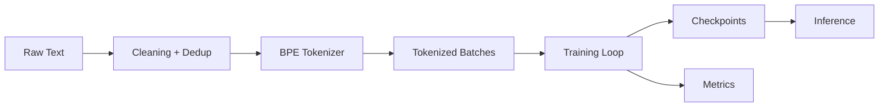

# AntiMatter - 300M Parameter Transformer Language Model


A custom decoder-only transformer language model trained from scratch, with a full pipeline for data prep, tokenization, training, evaluation, and inference.

## At a glance

| Item | Value |
| --- | --- |
| Parameters | 300,124,416 |
| Layers | 24 |
| Hidden size | 1024 |
| Attention heads | 16 |
| Vocabulary | 50,257 BPE |
| Context length | 2048 tokens |
| Dataset size | 45 GB raw (38 GB cleaned) |
| Training steps | 100,000 |
| Training setup | 4x A100, mixed precision |

## Highlights

- End-to-end pipeline from raw text to trained checkpoints
- Custom BPE tokenizer and vocabulary management
- Training, evaluation, and inference scripts
- Reproducible configuration in [configs/model_config.yaml](configs/model_config.yaml)

## Architecture

Decoder-only transformer with multi-head self-attention, feed-forward blocks, layer normalization, and residual connections. Tokenization uses BPE with a 50,257 vocabulary.



## Quick start

1. Install dependencies:
  ```bash
  pip install -r requirements.txt
  ```
2. Run inference:
  ```bash
  python scripts/run_inference.py
  ```
3. Evaluate:
  ```bash
  python scripts/evaluate_model.py
  ```

## Project docs

- [COMPETITION_GUIDE.md](COMPETITION_GUIDE.md)
- [PROJECT_SUMMARY.md](PROJECT_SUMMARY.md)
- [docs/ARCHITECTURE.md](docs/ARCHITECTURE.md)
- [docs/DATA_PREPROCESSING.md](docs/DATA_PREPROCESSING.md)
- [docs/TRAINING.md](docs/TRAINING.md)
- [docs/TIMELINE.md](docs/TIMELINE.md)

## Notebooks

- [notebooks/01_data_exploration.ipynb](notebooks/01_data_exploration.ipynb)
- [notebooks/02_preprocessing.ipynb](notebooks/02_preprocessing.ipynb)
- [notebooks/03_tokenization.ipynb](notebooks/03_tokenization.ipynb)
- [notebooks/04_evaluation.ipynb](notebooks/04_evaluation.ipynb)

## Project structure

```
AntiMatter/
├── configs/
├── docs/
├── notebooks/
├── scripts/
└── src/
```

## Outputs

- Generated artifacts after training: checkpoints/, logs/, results/, data/processed/
- Sample generations: results/generated_samples/

## License

Educational and research use only.

## Author

NOMAN SHAKIR  
nomanshaker2@gmail.com

Last Updated: December 2025  
Status: Training Complete
